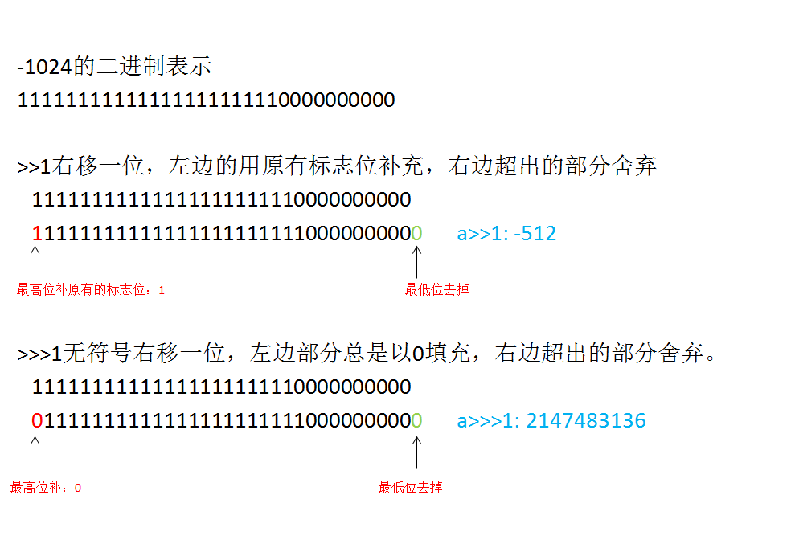
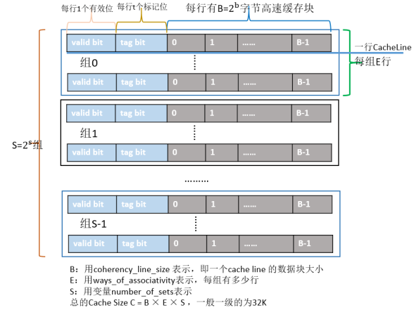
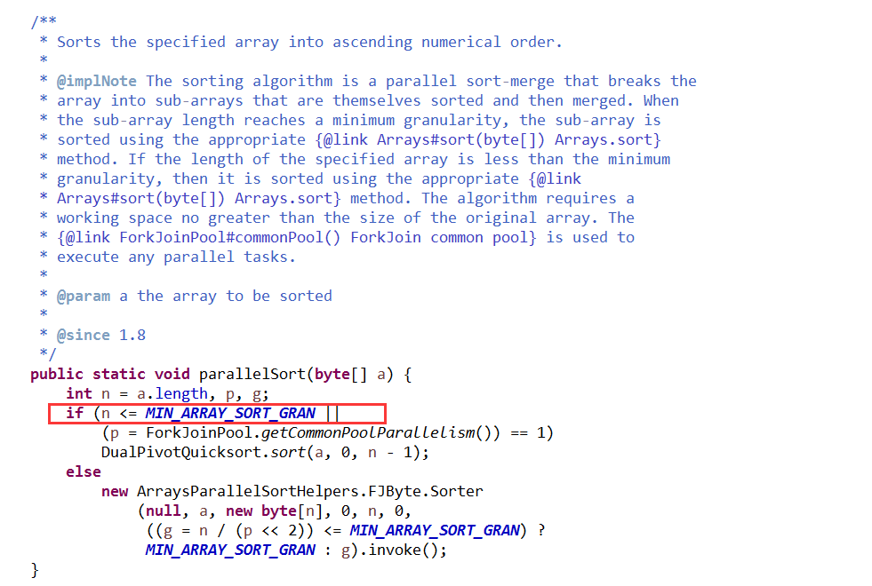
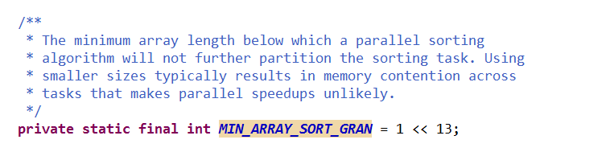

# 习题解答

## 1.下面为什么会出错？给出解释，并且纠正错误
 ```
 byte ba=127;
 byte bb=ba<<2;
 System.out.println(bb);
```
答：位运算是针对整型的，进行位操作时，除long型外，其他类型会自动转成int型
```
byte ba=127;
int bb=ba<<2;
System.out.println(bb);
```
输出：
```
508
```

## 2.int a=-1024;给出 a>>1与a>>>1的的结果，并且用位移方式图示解释



```
int a=-1024;

System.out.println(Integer.toBinaryString(a));
System.out.println(Integer.toBinaryString(a>>1));
System.out.println(Integer.toBinaryString(a>>>1));

System.out.println("a>>1: " + (a>>1));
System.out.println("a>>>1: " + (a>>>1));
```
输出：
```
11111111111111111111110000000000
11111111111111111111111000000000
1111111111111111111111000000000
a>>1: -512
a>>>1: 2147483136
```

## 3.定义一个10240*10240的byte数组，分别采用行优先与列优先的循环方式来计算 这些单元格的总和，看看性能的差距，并解释原因。
行优先的做法，每次遍历一行，然后到下一行。

代码如下：
```
public static void main(String[] args) {
			
	byte[][] cloumnByte = new byte[1024][1024];
	Random random = new Random();
	for(int i = 0; i < cloumnByte.length; i++){
		for(int j = 0; j < cloumnByte[i].length; j++){
			cloumnByte[i][j] = (byte) random.nextInt(100);
		}
	}
	
	countByRow(cloumnByte);
	countByColumn(cloumnByte);

	}
	
	/**
	 * 行优先
	 * @param cloumnByte
	 */
	public static void countByRow(byte[][] cloumnByte){
		long startTime = System.currentTimeMillis();
		int sum = 0;
		for(int i = 0; i < cloumnByte.length; i++){
			for(int j = 0; j < cloumnByte[i].length; j++){
				sum += cloumnByte[i][j];
			}
		}
		
		System.out.println("用时:" + (System.currentTimeMillis() - startTime));
		System.out.println("sum = " + sum);
	}
	
	/**
	 * 列优先
	 * @param cloumnByte
	 */
	public static void countByColumn(byte[][] cloumnByte){
		long startTime = System.currentTimeMillis();
		int sum = 0;
		for(int i = 0; i < cloumnByte.length; i++){
			for(int j = 0; j < cloumnByte[i].length; j++){
				sum += cloumnByte[j][i];
			}
		}
		
		System.out.println("用时:" + (System.currentTimeMillis() - startTime));
		System.out.println("sum = " + sum);
	}
```

输出：
```
用时:20
sum = 51917472
用时:27
sum = 51917472
```

原因分析：

以我们常见的X86芯片为例，Cache的结构下图所示：整个Cache被分为S个组，每个组是又由E行个最小的存储单元——Cache Line所组成，而一个Cache Line中有B（B=64）个字节用来存储数据，即每个Cache Line能存储64个字节的数据，每个Cache Line又额外包含一个有效位(valid bit)、t个标记位(tag bit)，其中valid bit用来表示该缓存行是否有效；tag bit用来协助寻址，唯一标识存储在CacheLine中的块；而Cache Line里的64个字节其实是对应内存地址中的数据拷贝。根据Cache的结构题，我们可以推算出每一级Cache的大小为B×E×S。



局部性包括时间局部性、空间局部性。时间局部性：对于同一数据可能被多次使用，自第一次加载到Cache Line后，后面的访问就可以多次从Cache Line中命中，从而提高读取速度（而不是从下层缓存读取）。空间局部性：一个Cache Line有64字节块，我们可以充分利用一次加载64字节的空间，把程序后续会访问的数据，一次性全部加载进来，从而提高Cache Line命中率（而不是重新去寻址读取）。
行优先的做法使得数据连续一个Cache Line中命中率提高，提升性能。

## 4.定义Java类Salary {String name, int baseSalary, int bonus  },随机产生1万个实例，属性也随机产生（baseSalary范围是5-100万，bonus为（0-10万），其中name长度为5，随机字符串，然后进行排序，排序方式为收入总和（baseSalary*13+bonus），输出收入最高的10个人的名单

代码如下：

```
package zhan.foundation.lesson01;

public class Salary implements Comparable<Salary>{

	private String name;
	private int baseSalary;
	private int bonus;
	
	public Salary(String name,int baseSalary,int bonus){
		this.name = name;
		this.baseSalary = baseSalary;
		this.bonus = bonus;
	}
	
	public String toString(){
		return "name = " + name + " （baseSalary*13+bonus）=" + (baseSalary*13 + bonus);
	}
	
	@Override
	public int compareTo(Salary o){
		
		if(this.baseSalary*13 + this.bonus < o.baseSalary*13 + o.bonus){
			return 1;
		}
		if(this.baseSalary*13 + this.bonus == o.baseSalary*13 + o.bonus){
			return 0;
		}
		else{
			return -1;
		}

	}

	public String getName() {
		return name;
	}

	public void setName(String name) {
		this.name = name;
	}

	public int getBaseSalary() {
		return baseSalary;
	}

	public void setBaseSalary(int baseSalary) {
		this.baseSalary = baseSalary;
	}

	public int getBonus() {
		return bonus;
	}

	public void setBonus(int bonus) {
		this.bonus = bonus;
	}
}
```

```
package zhan.foundation.lesson01;

import java.util.Arrays;
import java.util.Random;


public class Exercises04 {

	public static void main(String[] args) {
		System.out.println("getTopSalaryNormal():");
		getTopSalaryNormal();
		System.out.println("getTopSalaryStream():");
		getTopSalaryStream();
	}
	
	/**
	 * 普通方法
	 */
	public static void getTopSalaryNormal(){
		long startTime = System.currentTimeMillis();
		Random random = new Random();
		int arrayLength = 10000;
		Salary[] salaryArray = new Salary[arrayLength];
		for(int i = 0; i < arrayLength; i++){
			salaryArray[i] = new Salary(getRomdomString(5),random.nextInt(950000) + 50000,random.nextInt(100000));
		}
		
		Arrays.sort(salaryArray);
		
		for(int i = 0; i < 10; i++){
			System.out.println(salaryArray[i]);
		}
		
		System.out.println("用时：" + (System.currentTimeMillis() - startTime));
	}
	
	/**
	 * stream()方法
	 */
	public static void getTopSalaryStream(){
		long startTime = System.currentTimeMillis();
		Random random = new Random();
		int arrayLength = 10000;
		Salary[] salaryArray = new Salary[arrayLength];
		for(int i = 0; i < arrayLength; i++){
			salaryArray[i] = new Salary(getRomdomString(5),random.nextInt(950000) + 50000,random.nextInt(100000));
		}
		
		Arrays.stream(salaryArray).sorted().limit(10).forEach(System.out::println);
		
		System.out.println("用时：" + (System.currentTimeMillis() - startTime));
	}
	
	public static String getRomdomString(int length){
		String baseStr = "abcdefghijklmnopqrstuvwxyz";
		Random random = new Random();
		StringBuffer strBuff = new StringBuffer();
		for(int i = 0; i < length; i++){
			strBuff.append(baseStr.charAt(random.nextInt(baseStr.length())));
		}
		return strBuff.toString();
	}

}
```

输出:
```
getTopSalaryNormal():
name = umjyy （baseSalary*13+bonus）=13096529
name = vbcbv （baseSalary*13+bonus）=13093610
name = sshci （baseSalary*13+bonus）=13090939
name = egyle （baseSalary*13+bonus）=13084304
name = jwqki （baseSalary*13+bonus）=13083056
name = znerr （baseSalary*13+bonus）=13064515
name = xofrq （baseSalary*13+bonus）=13062329
name = bqgjk （baseSalary*13+bonus）=13055230
name = ekqti （baseSalary*13+bonus）=13053852
name = wppjl （baseSalary*13+bonus）=13053822
用时：55
getTopSalaryStream():
name = pleku （baseSalary*13+bonus）=13091742
name = rxruq （baseSalary*13+bonus）=13075747
name = vyiaf （baseSalary*13+bonus）=13063032
name = enfpb （baseSalary*13+bonus）=13054534
name = gxqzo （baseSalary*13+bonus）=13049152
name = rzxsi （baseSalary*13+bonus）=13041101
name = yqbuy （baseSalary*13+bonus）=13039940
name = wmwwo （baseSalary*13+bonus）=13036446
name = fwqpd （baseSalary*13+bonus）=13033587
name = tksvm （baseSalary*13+bonus）=13027938
用时：174
```

奇怪，为什么stream()方法会慢很多？


## 5.编码实现下面的要求：现有对象 MyItem {byte type,byte color,byte price} ，要求将其内容存放在一个扁平的byte[]数组存储数据的ByteStore {byte[] storeByteArry}对象里,即每个MyItem占用3个字节，第一个MyItem占用storeByteArry[0]-storeByteArry[2] 3个连续字节，以此类推，最多能存放1000个MyItem对象。ByteStore提供如下方法：putMyItem(int index,MyItem item) 在指定的Index上存放MyItem的属性，这里的Index是0-999，而不是storeByteArry的Index；getMyItem(int index),从指定的Index上查找MyItem的属性，并返回对应的MyItem对象。要求放入3个MyItem对象（index为0-2）并比较getMyItem方法返回的这些对象是否与之前放入的对象equal。

代码如下：
ByteStore类
```
package zhan.foundation.lesson01;

public class ByteStore {
	
	public Byte[] storeByteArry = new Byte[3000];
	
	public void putMyItem(int index,MyItem item){
		storeByteArry[index*3] = item.getType();
		storeByteArry[index*3 + 1] = item.getColor();
		storeByteArry[index*3 + 2] = item.getPrice();
	}
	
	public MyItem getMyItem(int index){
		return new MyItem(storeByteArry[index*3],storeByteArry[index*3 + 1],storeByteArry[index*3 + 2]);
	}
}
```

MyItem类
```
package zhan.foundation.lesson01;

public class MyItem {
	private byte type;
	private byte color;
	private byte price;
	
	public MyItem(){
		
	}
	
	public MyItem(byte type,byte color,byte price){
		this.setType(type);
		this.setColor(color);
		this.setPrice(price);
	}

	public byte getType() {
		return type;
	}

	public void setType(byte type) {
		this.type = type;
	}

	public byte getColor() {
		return color;
	}

	public void setColor(byte color) {
		this.color = color;
	}

	public byte getPrice() {
		return price;
	}

	public void setPrice(byte price) {
		this.price = price;
	}
	
	
}
```
测试类:
```
package zhan.foundation.lesson01;

public class Exercises05 {
	
	public static void main(String[] args) {
		MyItem myItem1 = new MyItem((byte)0,(byte)1,(byte)2);
		MyItem myItem2 = new MyItem((byte)3,(byte)4,(byte)5);
		MyItem myItem3 = new MyItem((byte)6,(byte)7,(byte)8);
		
		ByteStore byteStore = new ByteStore();
		byteStore.putMyItem(0, myItem1);
		byteStore.putMyItem(1, myItem2);
		byteStore.putMyItem(2, myItem3);
		
		System.out.println(myItem1.equals(byteStore.getMyItem(0)));
		System.out.println(myItem2.equals(byteStore.getMyItem(1)));
		System.out.println(myItem3.equals(byteStore.getMyItem(2)));

	}
}
```

运行结果：
```
false
false
false
```

### 加分功能如下：放入1000个MyItem对象到ByteStore中，采用某种算法对storeByteArry做排序，排序以price为基准，排序完成后，输出前100个结果

采用快速排序算法,代码如下：
```
package zhan.foundation.lesson01;
import java.util.Random;

public class Exercises0502 {
	
public static void main(String[] args) {
		
		ByteStore byteStore = new ByteStore();
		Random random = new Random();
		for(int i = 0; i < 1000; i++){
			byteStore.putMyItem(i, new MyItem((byte)random.nextInt(127),(byte)random.nextInt(127),(byte)random.nextInt(127)));
		}
		
		
		quick(byteStore.storeByteArry,0,byteStore.storeByteArry.length - 3);
		
		for(int i = 0; i < 1000; i++){
			System.out.println(byteStore.storeByteArry[i*3] + " " + byteStore.storeByteArry[i*3+1] + " " + byteStore.storeByteArry[i*3+2]);
		}
	}
	
	
	//快速排序
    public static void quick(Byte[] storeByteArry,int low,int high){
        if(low < high){
            int middle = getMiddle(storeByteArry,low,high);
            quick(storeByteArry,low,middle-3);
            quick(storeByteArry,middle+3,high);
        }
    }
    
    public static int getMiddle(Byte[] storeByteArry,int low,int high){
        byte tmp1 = storeByteArry[low];
        byte tmp2 = storeByteArry[low + 1];
        byte tmp3 = storeByteArry[low + 2];
        while(low < high){
            while(low < high && storeByteArry[high + 2] >= tmp3){
                high = high - 3;
            }
            storeByteArry[low] = storeByteArry[high];
            storeByteArry[low + 1] = storeByteArry[high + 1];
            storeByteArry[low + 2] = storeByteArry[high + 2];

            while(low < high && storeByteArry[low + 2] < tmp3){
                low = low + 3;
            }
            storeByteArry[high] = storeByteArry[low];
            storeByteArry[high + 1] = storeByteArry[low + 1];
            storeByteArry[high + 2] = storeByteArry[low + 2];
        }
        storeByteArry[low] = tmp1;
        storeByteArry[low + 1] = tmp2;
        storeByteArry[low + 2] = tmp3;
        return low;
    }

}

```

输出：
```
40 24 0
45 82 0
108 121 0
11 60 0
16 93 0
30 8 0
28 63 1
30 31 1
113 76 1
107 112 1
101 29 1
...
```

## 6.Arrays.parallelSort在数组超过多少时候才开启并行排序？采用位运算，给出推导过程





1 << 13  左移13位后：10000000000000  即8192，数组超过8192时候才开启并行排序


## 7.DualPivotQuicksort算法与普通冒泡算法相比，有哪些改进，对比常见的几种基于数组的排序算法，说说为什么Java选择了快排
快排时间复杂度明显优于冒泡

### 以下是加分题目，第一：写出标准冒泡排序与快速排序的算法，排序对象为上面说的 Salary {name, baseSalary, bonus  },收入总和为baseSalary*13+bonus,以收入总和为排序标准。排序输出 年薪最高的100个人，输出结果为 xxxx:yyyy万

代码如下：
```
package zhan.foundation.lesson01;

import java.util.Random;

public class Exercises07 {
	public static void main(String[] args) {
		getTopMaopao();
		getTopQuick();
	}
	
	
	public static String getRomdomString(int length){
		String baseStr = "abcdefghijklmnopqrstuvwxyz";
		Random random = new Random();
		StringBuffer strBuff = new StringBuffer();
		for(int i = 0; i < length; i++){
			strBuff.append(baseStr.charAt(random.nextInt(baseStr.length())));
		}
		return strBuff.toString();
	}
	
	/**
	 * 冒泡排序
	 */
	public static void getTopMaopao(){
		long startTime = System.currentTimeMillis();
		Random random = new Random();
		int arrayLength = 10000;
		Salary[] salaryArray = new Salary[arrayLength];
		for(int i = 0; i < arrayLength; i++){
			salaryArray[i] = new Salary(getRomdomString(5),random.nextInt(950000) + 50000,random.nextInt(100000));
		}
		
		salaryArray = maopaoSalary(salaryArray);
		
		for(int i = salaryArray.length-1; i >= salaryArray.length-10; i--){
			System.out.println(salaryArray[i]);
		}
		
		System.out.println("用时：" + (System.currentTimeMillis() - startTime));
	}
	
	
	/**
	 * 快速排序
	 */
	public static void getTopQuick(){
		long startTime = System.currentTimeMillis();
		Random random = new Random();
		int arrayLength = 10000;
		Salary[] salaryArray = new Salary[arrayLength];
		for(int i = 0; i < arrayLength; i++){
			salaryArray[i] = new Salary(getRomdomString(5),random.nextInt(950000) + 50000,random.nextInt(100000));
		}
		
		quick(salaryArray,0,salaryArray.length-1);
		
		for(int i = 0; i < 10; i++){
			System.out.println(salaryArray[i]);
		}
		
		System.out.println("用时：" + (System.currentTimeMillis() - startTime));
	}
	
	
	
	 public static Salary[] maopaoSalary(Salary[] arry){
	        boolean noswap = true;
	        Salary temp;
	        for(int i=0; i<arry.length - 1; i++){
	            noswap = true;
	            for(int j=0; j<arry.length - 1 - i; j++){
	                if((arry[j].getBaseSalary()*13 + arry[j].getBonus()) <= (arry[j+1].getBaseSalary()*13 + arry[j+1].getBonus())){
	                    temp = arry[j];
	                    arry[j] = arry[j+1];
	                    arry[j+1] = temp;
	                    noswap = false;
	                }

	            }
	            if(noswap){
	                break;
	            }
	        }

	        return arry;
	    }
	 
	 
	 
	    public static void quick(Salary[] list,int low,int high){
	        if(low < high){
	            int middle = getMiddle(list,low,high);
	            quick(list,low,middle-1);
	            quick(list,middle+1,high);
	        }
	    }
	    
	    public static int getMiddle(Salary[] list,int low,int high){
	    	Salary tmp = list[low];
	        while(low < high){
	            while(low < high && (list[high].getBaseSalary()*13 + list[high].getBonus()) >= (tmp.getBaseSalary()*13 + tmp.getBonus())){
	                high--;
	            }
	            list[low] = list[high];

	            while(low < high && (list[low].getBaseSalary()*13 + list[low].getBonus()) < (tmp.getBaseSalary()*13 + tmp.getBonus())){
	                low++;
	            }
	           list[high] = list[low];
	        }
	        list[low] = tmp;
	        return low;
	    }
}
```

输出:
```
name = zgqxc （baseSalary*13+bonus）=660590
name = micvf （baseSalary*13+bonus）=669866
name = kolei （baseSalary*13+bonus）=678423
name = bkodq （baseSalary*13+bonus）=680151
name = nhdya （baseSalary*13+bonus）=690832
name = tybae （baseSalary*13+bonus）=693708
name = zhhji （baseSalary*13+bonus）=695274
name = anmyr （baseSalary*13+bonus）=699344
name = xomok （baseSalary*13+bonus）=700688
name = nhxwa （baseSalary*13+bonus）=703938
用时：1215
name = gwbjx （baseSalary*13+bonus）=669708
name = zpgqp （baseSalary*13+bonus）=671143
name = njfrl （baseSalary*13+bonus）=671280
name = ahzfp （baseSalary*13+bonus）=676149
name = jzrpt （baseSalary*13+bonus）=682938
name = fxeah （baseSalary*13+bonus）=685896
name = rxyff （baseSalary*13+bonus）=698590
name = gsfcn （baseSalary*13+bonus）=698887
name = tysgv （baseSalary*13+bonus）=700879
name = mabxu （baseSalary*13+bonus）=701725
用时：30

```

### 第二：第五题中的 storeByteArry改为int[]数组，采用Java位操作方式来实现1个Int 拆解为4个Byte，存放MyItem对象的属性。

代码如下：
```
package zhan.foundation.lesson01;

public class Exercises0702 {
	
	private static int[] storeByteArry = new int[100];
	
	public static void main(String[] args) {
		MyItem myItem = new MyItem((byte)2,(byte)4,(byte)5);
		putMyItem(0,myItem);
		
		MyItem myItem2 = getMyItem(0);
		System.out.println(myItem2.getType() + " " + myItem2.getColor() + " " + myItem2.getPrice());

	}
	
	
	public static void putMyItem(int index,MyItem item){
		storeByteArry[index] = (item.getType()) + (item.getColor() << 8) + (item.getPrice() << 16);
		System.out.println(Integer.toBinaryString(storeByteArry[index]));
	}
	
	
	public static MyItem getMyItem(int index){
		MyItem myItem = new MyItem();
		myItem.setType((byte)(storeByteArry[index] & 0xff));
		myItem.setColor((byte)(storeByteArry[index] >> 8 & 0xff));
		myItem.setPrice((byte)(storeByteArry[index] >> 16 & 0xff));
		
		return myItem;
	}
}

```
