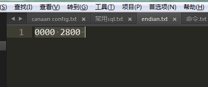
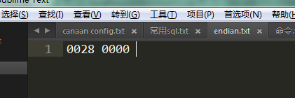

# 习题解答

## 1.得到 String s="中国" 这个字符串的utf-8编码，gbk编码，iso-8859-1编码的字符串，看看各自有多少字节，同时解释为什么以utf-8编码得到的byte[]无法用gbk的方式“还原”为原来的字符串
 ```
 public class Exercises01 {

	private final static char[] HEX = "0123456789abcdef".toCharArray();
	
	public static void main(String[] args) throws UnsupportedEncodingException {
		String s = "中国";
		byte[] utf8 = s.getBytes("utf-8");
		byte[] utf16 = s.getBytes("utf-16");
        byte[] gbk =  s.getBytes("gbk");
        byte[] iso = s.getBytes("iso-8859-1");
        System.out.println("utf-8 length: " + utf8.length);
        System.out.println("utf-16 length: " + utf16.length);
        System.out.println("gbk length: " + gbk.length);
        System.out.println("iso-8859-1 length: " + iso.length);
        System.out.println("utf-8 : " + bytes2HexString(utf8));
        System.out.println("utf-16 : " + bytes2HexString(utf16));
        System.out.println("gbk : " + bytes2HexString(gbk));
        System.out.println("iso-8859-1 : " + bytes2HexString(iso));


        String eUtf8 = new String(utf8,"gbk");
        System.out.println("error trans : " + eUtf8);

        String rUtf8 = new String(utf8,"utf-8");
        System.out.println("right trans : " + rUtf8);

        String eUtf16 = new String(utf16,"utf-8");
        System.out.println("error egbk : " + eUtf16);

        String rUtf16 = new String(utf16,"utf-16");
        System.out.println("right rgbk : " + rUtf16);


        String eGbk = new String(gbk,"utf-8");
        System.out.println("error egbk : " + eGbk);

        String rGbk = new String(gbk,"gbk");
        System.out.println("right rgbk : " + rGbk);
        
        String eIso = new String(iso,"utf-8");
        System.out.println("error egbk : " + eIso);

        String rIso = new String(iso,"iso-8859-1");
        System.out.println("right rgbk : " + rIso);

       
	}
	
	public static String bytes2HexString(byte[] bys) {
        char[] chs = new char[bys.length * 2 + bys.length - 1];
        for (int i = 0, offset = 0; i < bys.length; i++) {
            if (i > 0) {
                chs[offset++] = ' ';
            }
            chs[offset++] = HEX[bys[i] >> 4 & 0xf];
            chs[offset++] = HEX[bys[i] & 0xf];
        }
        return new String(chs);
    }

}
```
答：utf-8编码得到的byte[]长度是6，gbk编码的长度是4，编码规则不同，所以无法用gbk的方式“还原”为原来的字符串。

输出：
```
utf-8 length: 6
utf-16 length: 6
gbk length: 4
iso-8859-1 length: 2
utf-8 : e4 b8 ad e5 9b bd
utf-16 : fe ff 4e 2d 56 fd
gbk : d6 d0 b9 fa
iso-8859-1 : 3f 3f
error trans : 涓浗
right trans : 中国
error egbk : ��N-V�
right rgbk : 中国
error egbk : �й�
right rgbk : 中国
error egbk : ??
right rgbk : ??
```

## 2.分别用大头和小头模式将整数 a=10240写入到文件中（4个字节），并且再正确读出来，打印到屏幕上，同时截图UltraEdit里的二进制字节序列，做对比说明

大头模式：
```
public static void main(String[] args) throws IOException {
		int a = 10240;
		FileOutputStream fileOutput = new FileOutputStream("e://endian.txt");
		fileOutput.write(getByteBigEndian(a));
		FileInputStream fileInput = new FileInputStream("e://endian.txt");
		byte[] buffer = new byte[4];
		int count = 0;
		while((count = fileInput.read(buffer)) != -1){
			System.out.println(getIntBigEndian(buffer,0));
		}
		
		fileOutput.close();
		fileInput.close();
	}
	
	/**
	 * 获取大头byte数组
	 * @param a
	 * @return
	 */
	public static byte[] getByteBigEndian(int a){
		return new byte[]{
				(byte)((a >> 24) & 0xff),
				(byte)((a >> 16) & 0xff),
				(byte)((a >> 8) &0xff),
				(byte)(a & 0xff)
		};
	}
	
	/**
	 * 获取大头int
	 * @param b
	 * @param off
	 * @return
	 */
	public static int getIntBigEndian(byte[] b,int off){
		return (b[off] << 24) +
				((b[off + 1] & 0xff) << 16) +
				((b[off + 2] & 0xff) << 8) +
				((b[off + 3] & 0xff));
	}

```




小头模式：
```
public static void main(String[] args) throws IOException {
		int a = 10240;
		FileOutputStream fileOutput = new FileOutputStream("e://endian.txt");
		fileOutput.write(getByteLitEndian(a));
		FileInputStream fileInput = new FileInputStream("e://endian.txt");
		byte[] buffer = new byte[4];
		int count = 0;
		while((count = fileInput.read(buffer)) != -1){
			System.out.println(getIntLitEndian(buffer,0));
		}
		
		fileOutput.close();
		fileInput.close();
	}
	
	/**
	 * 获取大头byte数组
	 * @param a
	 * @return
	 */
	public static byte[] getByteLitEndian(int a){
		return new byte[]{
				(byte)(a & 0xff),
				(byte)((a >> 8) & 0xff),
				(byte)((a >> 16) &0xff),
				(byte)((a >> 24) & 0xff)
		};
	}
	
	/**
	 * 获取大头int
	 * @param b
	 * @param off
	 * @return
	 */
	public static int getIntLitEndian(byte[] b,int off){
		return (b[off] & 0xff) +
				((b[off + 1] & 0xff) << 8) +
				((b[off + 2] & 0xff) << 16) +
				((b[off + 3] & 0xff) << 24);
	}


```



## 3.整理全套的Java IO类图并用PPT讲解说明

## 4.随机生成 Salary {name, baseSalary, bonus  }的记录，如“wxxx,10,1”，每行一条记录，总共1000万记录，写入文本文件（UFT-8编码），
   然后读取文件，name的前两个字符相同的，其年薪累加，比如wx，100万，3个人，最后做排序和分组，输出年薪总额最高的10组：
         wx, 200万，10人
         lt, 180万，8人
         ....

```
public class Exercises03 {


	public static void main(String[] args) throws Exception {
		long stratWriteTime = System.currentTimeMillis();
		writeToBufferedWriter("f:\\salaryWriterChannel.txt");
		long endWriteTime = System.currentTimeMillis();
        System.out.println("write cost : " + (endWriteTime - stratWriteTime));
        readFromBufferedReader("f:\\salaryWriterChannel.txt");
        System.out.println("read cost : " + (System.currentTimeMillis() - endWriteTime));
        System.out.println("all cost : " + (System.currentTimeMillis() - stratWriteTime));

	}
	
	 /**
	  * 按字符写入文件
	  * @param filename
	  * @throws Exception
	  */
	 public static void writeToBufferedWriter(String filename) throws Exception{
		 try(FileWriter reader = new FileWriter(filename);
	        BufferedWriter bufferedWrite = new BufferedWriter(reader)){
	        	Random random = new Random();
	 	        int count = 10_000_000;
	 	        char[] name = new char[5];

	 	        String writeStr;
	 	        for(int i = 0; i < count; i++){
	 	            for(int j = 0; j < 5;j++){
	 	                name[j] = (char)(random.nextInt(26) + 97);
	 	            }

	 	            writeStr =  String.valueOf(name) + "," + random.nextInt(1000000) + "," + random.nextInt(1000000) + '\n';
	 	            bufferedWrite.write(writeStr);
	 	        }

	 	        bufferedWrite.flush();
	 	        System.out.println("writeToBufferedWriter write " + count + " done");
	        }
	    }
	 
	 /**
	  * 按字符读取
	  * @param filename
	  * @throws FileNotFoundException
	  * @throws IOException
	  */
	 public static void readFromBufferedReader(String filename) throws FileNotFoundException, IOException{
		 try(FileReader reader = new FileReader(filename);
			 BufferedReader bufferedReader = new BufferedReader(reader)){
			 bufferedReader.lines()
			 	.map(m->m.split(","))
			 	.collect(Collectors.groupingBy(s->s[0].substring(0,2),
                        Collector.of(()->new long[2],
                                (a,sa)->{
                                    a[0] += Long.parseLong(sa[1]) + Long.parseLong(sa[2]);
                                    a[1] += 1L;
                                },
                                (a,b)->{
                                    a[0] += b[0];
                                    a[1] += b[1];
                                    return a;
                                }
                            )
                        )
                )
                .entrySet().stream()
                .sorted((a,b)->Long.compare(b.getValue()[0],a.getValue()[0]))
                .limit(10)
                .forEach(s->System.out.printf("%s,%s,%s\n",s.getKey(),s.getValue()[0],s.getValue()[1]));
			
		 }
	 }


}

```

输出：
```
writeToBufferedWriter write 10000000 done
write cost : 6721
cc,15151136837,15115
ov,15133190022,15101
yc,15131698232,15106
iw,15129720733,15174
yx,15115167899,15082
bx,15099533668,15034
di,15088272476,15076
zl,15082800932,14954
wu,15079935014,15127
zo,15079886110,15045
read cost : 10514
all cost : 17235
```

## 加分题

## 1.用装饰者模式实现如下的功能：
     要求用户输入一段文字，比如 Hello Me，然后屏幕输出几个选项
       1 ：加密
       2 ：反转字符串
       3：转成大写
       4：转成小写
       5：扩展或者剪裁到10个字符，不足部分用！补充
       6:用户输入 任意组合，比如 1，3 表示先执行1的逻辑，再执行3的逻辑
       
       根据用户输入的选择，进行处理后，输出结果


## 2.用FileChannel的方式实现第四题，注意编码转换问题，并对比性能

