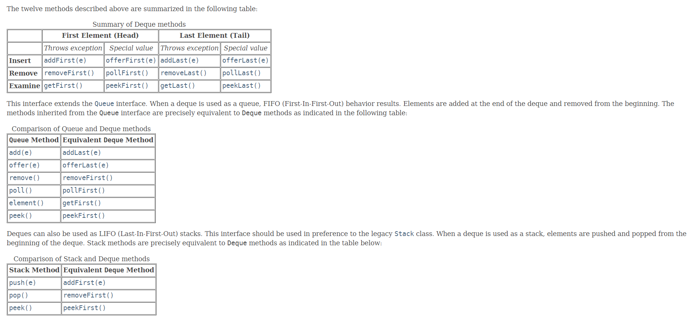

# 习题解答

## 1.分析Collection接口以及其子接口，很通俗的方式说说，究竟有哪些类型的Collection，各自解决什么样的问题

### Collection
* List
	1. 元素顺序均是按添加的先后进行排列的
  	2. 允许重复的元素
  	3. 允许多个null元素  
* Set
	1. 没有重复的元素
  	2. 最多只能有一个null元素
  	3. 元素没有顺序
* Queue
	1. 元素通常采用先进先出规则
	2. 允许重复的元素
  	3. 不能插入nul元素


## 2.TreeSet继承了什么Set，与HashSet的区别是？HashSet与HashTable是“一脉相承”的么？
1. TreeSet继承了AbstractSet，NavigableSet（可搜索匹配），SortedSet（按顺序保存元素），是一个有序存储的集合
2. HashSet继承了AbstractSet，是一个无序存储的集合
3. HashSet继承自Collection接口，HashTable继承自Map接口是属于不同的家族

## 3.Queue接口增加了哪些方法，这些方法的作用和区别是？


add(e) 插入一个元素，如果成功返回true，失败则抛出IllegalStateException异常。
offer(e)插入一个元素，如果成功返回true，失败返回false。
remove()删除并返回队列第一个元素，失败则抛出NoSuchElementException异常。
poll()删除并返回队列第一个元素，失败则返回null。
element()返回队列的第一个元素，失败抛出NoSuchElementException异常。
peek()返回队列的第一个元素，失败返回null。


## 4.LinkedList也是一种Queue么？是否是双向链表?
LinkedList也是一种Queue,LinkedList同时实现了List和Deque接口。

Deque能像Queue和Stack一样存取数据，能同时在头和尾操作数据，是一个双向列表。

## 5.Java数组如何与Collection相互转换
Collection转数组用toArry()方法 
数组转Collection用Arrays.asList()方法


## 6.Map的一级子接口有哪些种类，分别用作什么目的？
Map的一级子接口有：
1.SortedMap,保证元素是按一定的顺序保存的。
2.ConcurrentMap，线程安全的，保证原子操作。


## 7.HashSet与HashMap中放入的自定义对象必须要实现哪些方法，说明原因
HashSet的add方法是通过HashMap的put方法实现的，必须同时实现hashCode()和equals方法。

对于包含容器类型的程序设计语言来说，基本上都会涉及到hashCode。在Java中也一样，hashCode方法的主要作用是为了配合基于散列的集合一起正常运行，这样的散列集合包括HashSet、HashMap以及HashTable。

为什么这么说呢？考虑一种情况，当向集合中插入对象时，如何判别在集合中是否已经存在该对象了？（注意：集合中不允许重复的元素存在）

也许大多数人都会想到调用equals方法来逐个进行比较，这个方法确实可行。但是如果集合中已经存在一万条数据或者更多的数据，如果采用equals方法去逐一比较，效率必然是一个问题。此时hashCode方法的作用就体现出来了，当集合要添加新的对象时，先调用这个对象的hashCode方法，得到对应的hashcode值，实际上在HashMap的具体实现中会用一个table保存已经存进去的对象的hashcode值，如果table中没有该hashcode值，它就可以直接存进去，不用再进行任何比较了；如果存在该hashcode值， 就调用它的equals方法与新元素进行比较，相同的话就不存了，不相同就散列其它的地址，所以这里存在一个冲突解决的问题，这样一来实际调用equals方法的次数就大大降低了，说通俗一点：Java中的hashCode方法就是根据一定的规则将与对象相关的信息（比如对象的存储地址，对象的字段等）映射成一个数值，这个数值称作为散列值。

```
public class User {

    private String name;
    private int age;

   public  User(String name,int age){
       this.name = name;
       this.age = age;
   }

    @Override
    public int hashCode(){
       return this.name.hashCode() + this.age;
    }

    @Override
    public boolean equals(Object obj){
        return this.name.equals(((User)obj).name) && this.age == (((User)obj).age);
    }
}


 public static void main(String[] args) throws Exception {
        HashMap hashMap = new HashMap();
        User user1 = new User("zhan",15);
        User user2 = new User("zhan",15);
        System.out.println(user1.hashCode());
        System.out.println(user2.hashCode());
        hashMap.put(user1,"1");

        System.out.println(hashMap.get(user2));
    }
```

输出
```
3737578
3737578
1
```


## 8.TreeSet里的自定义对象必须要实现什么方法，说明原因
TreeSet里的自定义对象必须要实现Comparable的compareTo方法，通过该方法实现元素的有序插入。

## 9.LinkedHashMap使用什么来保存数据，其效率与HashMap相比如何？它又有什么独特特性
LinkedHashMap是插入有序的

## 10.IdentityHashMap 里面如果按照下面的方法放入对象，分别是什么结果，请解释原因
        Integer a=5;
        Integer b=5;
        map.put(a,"100");
        map.put(b,"100";
        System.out.println(map.size);
        map.clear();
       Integer a=Integer.MAX_VALUE-1;
       Integer b=Integer.MAX_VALUE-1;
       map.put(a,"100");
        map.put(b,"100";
        System.out.println(map.size);
输出
```
1
2
```
IdentityHashMap类判断key是否相等是根据对象的引用判断的，是用==不是用equals判断。
Integer会缓存-128, 127之间的数值，他们的对象地址是相同的，所以a=5会被b=5覆盖。


## 加分题，
给出ＪＤＫ　１.８的java 集合框架全图谱（Class类图）， 并标明1.7与1.8里出现的新的类，解释其目的