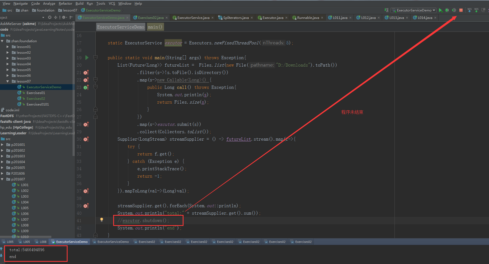

# 习题解答

## 1.1 解释为什么下面放入会失败

 ```
 SynchronousQueue<String> queue=new SynchronousQueue();
    if(queue.offer("S1"))
    {
        System.out.println("scucess");
    }else
    {
        System.out.println("faield");
    }
```

答：A {@linkplain BlockingQueue blocking queue} in which each insert
  operation must wait for a corresponding remove operation by another
  thread, and vice versa.A synchronous queue does not have any
  internal capacity, not even a capacity of one.  You cannot
  {@code peek} at a synchronous queue because an element is only
  present when you try to remove it; you cannot insert an element
  (using any method) unless another thread is trying to remove it;
  you cannot iterate as there is nothing to iterate.


```
public static void main(String[] args){
        SynchronousQueue<Object> queue = new SynchronousQueue<Object>();
        
        List<Thread> threadListCustomer = IntStream.range(0,5)
                .mapToObj(t->{
                    return new Thread(()->{
                        System.out.println(Thread.currentThread().getName() + " take begin");
                        Object item = null;
                        try {
                            while((item = queue.take()) != null){
                                System.out.println(Thread.currentThread().getName() + " take " +  item.toString() + "item");
                                System.out.println(Thread.currentThread().getName() + " take end");
                            }
                        } catch (InterruptedException e) {
                            e.printStackTrace();
                        }
                    });
                })
                .collect(Collectors.toList());
        
        threadListCustomer.forEach(t->t.start());
        
        
        List<Thread> threadListProductor = IntStream.range(0,5)
                .mapToObj(t->{
                    return new Thread(()->{
                        System.out.println(Thread.currentThread().getName() + " offer begin");
                        Object item = new Object();
                        while(queue.offer(item)){
                            System.out.println(Thread.currentThread().getName() + " offer " +  item.toString() + "item");
                            System.out.println(Thread.currentThread().getName() + " offer end");
                        }
                    });
                })
                .collect(Collectors.toList());
        
        threadListProductor.forEach(t->t.start());
        
    }
```

输出
```
Thread-1 take begin
Thread-3 take begin
Thread-2 take begin
Thread-4 take begin
Thread-0 take begin
Thread-5 offer begin
Thread-6 offer begin
Thread-7 offer begin
Thread-7 offer java.lang.Object@12b6fa6fitem
Thread-8 offer begin
Thread-6 offer java.lang.Object@758056e9item
Thread-6 offer end
Thread-6 offer java.lang.Object@758056e9item
Thread-6 offer end
Thread-3 take java.lang.Object@758056e9item
Thread-3 take end
Thread-4 take java.lang.Object@12b6fa6fitem
Thread-4 take end
Thread-7 offer end
Thread-7 offer java.lang.Object@12b6fa6fitem
Thread-7 offer end
Thread-7 offer java.lang.Object@12b6fa6fitem
Thread-7 offer end
Thread-9 offer begin
Thread-1 take java.lang.Object@758056e9item
Thread-1 take end
Thread-0 take java.lang.Object@2eda1c97item
Thread-2 take java.lang.Object@291e1298item
Thread-2 take end
Thread-8 offer java.lang.Object@291e1298item
Thread-8 offer end
Thread-5 offer java.lang.Object@2eda1c97item
Thread-5 offer end
Thread-8 offer java.lang.Object@291e1298item
Thread-2 take java.lang.Object@291e1298item
Thread-2 take end
Thread-0 take end
Thread-4 take java.lang.Object@12b6fa6fitem
Thread-3 take java.lang.Object@12b6fa6fitem
Thread-4 take end
Thread-8 offer end
Thread-1 take java.lang.Object@2eda1c97item
Thread-1 take end
Thread-5 offer java.lang.Object@2eda1c97item
Thread-8 offer java.lang.Object@291e1298item
Thread-8 offer end
Thread-8 offer java.lang.Object@291e1298item
Thread-8 offer end
Thread-8 offer java.lang.Object@291e1298item
Thread-8 offer end
Thread-8 offer java.lang.Object@291e1298item
Thread-8 offer end
Thread-4 take java.lang.Object@291e1298item
Thread-4 take end
Thread-3 take end
Thread-2 take java.lang.Object@291e1298item
Thread-2 take end
Thread-0 take java.lang.Object@291e1298item
Thread-0 take end
Thread-1 take java.lang.Object@291e1298item
Thread-1 take end
Thread-5 offer end
Thread-5 offer java.lang.Object@2eda1c97item
Thread-5 offer end
Thread-5 offer java.lang.Object@2eda1c97item
Thread-5 offer end
Thread-1 take java.lang.Object@2eda1c97item
Thread-2 take java.lang.Object@2eda1c97item
Thread-2 take end
Thread-5 offer java.lang.Object@2eda1c97item
Thread-0 take java.lang.Object@2eda1c97item
Thread-0 take end
Thread-5 offer end
Thread-1 take end
Thread-0 take java.lang.Object@2eda1c97item
Thread-0 take end
Thread-5 offer java.lang.Object@2eda1c97item
Thread-5 offer end
Thread-5 offer java.lang.Object@2eda1c97item
Thread-5 offer end
Thread-5 offer java.lang.Object@2eda1c97item
Thread-5 offer end
Thread-0 take java.lang.Object@2eda1c97item
Thread-0 take end
Thread-2 take java.lang.Object@2eda1c97item
Thread-2 take end
Thread-5 offer java.lang.Object@2eda1c97item
Thread-5 offer end
Thread-1 take java.lang.Object@2eda1c97item
Thread-2 take java.lang.Object@2eda1c97item
Thread-5 offer java.lang.Object@2eda1c97item
Thread-5 offer end
Thread-2 take end
Thread-0 take java.lang.Object@2eda1c97item
Thread-0 take end
Thread-1 take end
Thread-5 offer java.lang.Object@2eda1c97item
Thread-5 offer end
Thread-5 offer java.lang.Object@2eda1c97item
Thread-5 offer end
Thread-1 take java.lang.Object@2eda1c97item
Thread-1 take end
Thread-0 take java.lang.Object@2eda1c97item
Thread-0 take end
Thread-5 offer java.lang.Object@2eda1c97item
Thread-5 offer end
Thread-5 offer java.lang.Object@2eda1c97item
Thread-5 offer end
Thread-5 offer java.lang.Object@2eda1c97item
Thread-5 offer end
Thread-5 offer java.lang.Object@2eda1c97item
Thread-2 take java.lang.Object@2eda1c97item
Thread-2 take end
Thread-1 take java.lang.Object@2eda1c97item
Thread-1 take end
Thread-0 take java.lang.Object@2eda1c97item
Thread-0 take end
Thread-5 offer end
Thread-5 offer java.lang.Object@2eda1c97item
Thread-5 offer end
Thread-5 offer java.lang.Object@2eda1c97item
Thread-1 take java.lang.Object@2eda1c97item
Thread-1 take end
Thread-0 take java.lang.Object@2eda1c97item
Thread-0 take end
Thread-5 offer end
Thread-5 offer java.lang.Object@2eda1c97item
Thread-5 offer end
Thread-0 take java.lang.Object@2eda1c97item
Thread-0 take end
Thread-1 take java.lang.Object@2eda1c97item
Thread-1 take end
Thread-5 offer java.lang.Object@2eda1c97item
Thread-5 offer end
Thread-5 offer java.lang.Object@2eda1c97item
Thread-5 offer end
Thread-1 take java.lang.Object@2eda1c97item
Thread-1 take end
Thread-0 take java.lang.Object@2eda1c97item
Thread-0 take end
Thread-5 offer java.lang.Object@2eda1c97item
Thread-5 offer end
Thread-5 offer java.lang.Object@2eda1c97item
Thread-5 offer end
Thread-5 offer java.lang.Object@2eda1c97item
Thread-5 offer end
Thread-5 offer java.lang.Object@2eda1c97item
Thread-2 take java.lang.Object@2eda1c97item
Thread-2 take end
Thread-0 take java.lang.Object@2eda1c97item
Thread-0 take end
Thread-5 offer end
Thread-5 offer java.lang.Object@2eda1c97item
Thread-5 offer end
Thread-0 take java.lang.Object@2eda1c97item
Thread-0 take end
Thread-1 take java.lang.Object@2eda1c97item
Thread-1 take end
Thread-2 take java.lang.Object@2eda1c97item
Thread-5 offer java.lang.Object@2eda1c97item
Thread-5 offer end
Thread-2 take end
Thread-1 take java.lang.Object@2eda1c97item
Thread-1 take end
Thread-5 offer java.lang.Object@2eda1c97item
Thread-5 offer end
Thread-5 offer java.lang.Object@2eda1c97item
Thread-5 offer end
Thread-5 offer java.lang.Object@2eda1c97item
Thread-2 take java.lang.Object@2eda1c97item
Thread-2 take end
Thread-1 take java.lang.Object@2eda1c97item
Thread-1 take end
Thread-5 offer end
Thread-5 offer java.lang.Object@2eda1c97item
Thread-5 offer end
Thread-1 take java.lang.Object@2eda1c97item
Thread-2 take java.lang.Object@2eda1c97item
Thread-2 take end
Thread-5 offer java.lang.Object@2eda1c97item
Thread-5 offer end
Thread-5 offer java.lang.Object@2eda1c97item
Thread-5 offer end
Thread-5 offer java.lang.Object@2eda1c97item
Thread-5 offer end
Thread-5 offer java.lang.Object@2eda1c97item
Thread-5 offer end
Thread-5 offer java.lang.Object@2eda1c97item
Thread-5 offer end
Thread-1 take end
Thread-3 take java.lang.Object@2eda1c97item
Thread-4 take java.lang.Object@2eda1c97item
Thread-2 take java.lang.Object@2eda1c97item
Thread-2 take end
Thread-4 take end
Thread-3 take end
Thread-0 take java.lang.Object@2eda1c97item
Thread-0 take end

```


## 知识点：关于ExecutorService的shutdown()方法
ExecutorService调用结束后必须调用shutdown()方法关闭线程，否则mian线程结束后，线程池不会结束。



## fork-jion例子

```
package zhan.foundation.lesson07;

import java.util.Random;
import java.util.concurrent.ExecutionException;
import java.util.concurrent.ForkJoinPool;
import java.util.concurrent.Future;
import java.util.concurrent.RecursiveTask;
import java.util.stream.IntStream;

/**
 * Created by Administrator on 2018/4/30 0030.
 */
public class ForkJoinDemo extends RecursiveTask<Integer> {

    static private int[] array;
    private int beg;
    private int end;

    public ForkJoinDemo(int[] array,int beg,int end){
        super();
        this.array = array;
        this.beg = beg;
        this.end = end;
    }

    @Override
    protected Integer compute(){
        int result = 0;
        if(end - beg > 1){
            int mid = (end + beg) / 2;
            ForkJoinDemo f1 = new ForkJoinDemo(array,beg,mid);
            ForkJoinDemo f2 = new ForkJoinDemo(array,mid,end);
            invokeAll(f1,f2);
           /* f1.fork();
            f2.fork();*/
            try {
                result = f1.join() + f2.join();
                System.out.println("f1.join() = " + f1.join() + ",f2.join() = " + f2.join() + ",result = " + result);
            } catch (Exception e) {
                e.printStackTrace();
            }
        }else{
            result = count(array[beg]);
            System.out.println("result = " + result);
        }
        return  result;
    }

    //统计一个整数中出现了几个1
    public int count(int num){
        String strNum = String.valueOf(num);
        System.out.println("strNum = " + strNum);
        return strNum.length() - strNum.replace("1","").length();
    }

    public static void main(String[] args) throws ExecutionException, InterruptedException {
        Random random = new Random();
        array = new int[4];
        IntStream.range(0,4).forEach(i->array[i] = random.nextInt(10000));
        System.out.println("array.length = " + array.length);
        ForkJoinPool pool = new ForkJoinPool();
        ForkJoinDemo demo = new ForkJoinDemo(array,0,array.length);

        Future<Integer> result = pool.submit(demo);
        System.out.println(result.get());

       /* Integer res = pool.invoke(demo);
        System.out.println(res);*/
    }
}
```

输出:
```
array.length = 4
strNum = 6690
strNum = 9613
strNum = 4146
strNum = 3683
result = 0
result = 1
result = 1
result = 0
f1.join() = 0,f2.join() = 1,result = 1
f1.join() = 1,f2.join() = 0,result = 1
f1.join() = 1,f2.join() = 1,result = 2
2

Process finished with exit code 0

```


## 2.用线程池框架或者fork-jion框架实现一个并发的文件内容查找接口：
    public SearchResult searchInFiles(String key);
    查询指定目录下的所有txt或者java文件（建议查找Java工程文件）
    目录递归最多为4层，即从根目录开始，最多3层子目录中的文件搜索
    每个文件中如果出现关键字，则关键字的次数+1，并且将此文件的路径也保持到List中
    文件中出现关键字最多次的文件排名第一，以此类推：
    屏幕最后输出：
    xxx总共出现N次，
    其中 2次出现在yyy文件中
         3次出现在xxx文件中
 
 ### (1)线程程池框架实现：
 ```
 package zhan.foundation.lesson07;

import java.io.BufferedReader;
import java.io.File;
import java.io.FileReader;
import java.io.InputStream;
import java.nio.file.Files;
import java.util.HashMap;
import java.util.Map;
import java.util.concurrent.ExecutorService;
import java.util.concurrent.Executors;
import java.util.concurrent.TimeUnit;

/**
 * Created by Administrator on 2018/4/30 0030.
 */
public class Exercises02 {

    private static int allSum = 0;
    private static Map<String,Integer> fileMap = new HashMap<String,Integer>();
    private static final String keyWords = "String";

    /**
     * 查找文件
     * @param path  文件路径
     * @param currentDeepth  递归深度
     */
    public static void readFile(String path,int currentDeepth){
        int deeepth = currentDeepth;

        if(deeepth > 4){
            //System.out.println("deeepth is 4 return");
            return;
        }

        try{
            Files.list(new File(path).toPath())
                    .forEach(f-> {
                                if(f.toFile().isDirectory()) {
                                    readFile(f.toFile().getAbsolutePath(),deeepth + 1);
                                }else {
                                    String extendName = f.toFile().getName().substring(f.toFile().getName().lastIndexOf(".") + 1,f.toFile().getName().length());
                                    if("java".equals(extendName)){
                                        System.out.println("file.getAbsolutePath() = " + f.toFile().getAbsolutePath());
                                        countKeyWords(f.toFile().getAbsolutePath());
                                    }
                                }
                            }
                    );
        }catch (Exception e){
            e.printStackTrace();
        }
    }


    /**
     * 查找关键字出现次数
     * @param filePath 文件路径
     * @throws Exception
     */
    public static void countKeyWords(String filePath){
        try {
            FileReader fileReader = new FileReader(filePath);
            BufferedReader bufferedReader = new BufferedReader(fileReader);
            String line;
            int sum = 0;
            while ((line = bufferedReader.readLine()) != null) {
                if (line.contains(keyWords)) {
                    sum++;

                    line = line.replaceFirst(keyWords, "");
                    while (line.contains(keyWords)) {
                        line = line.replaceFirst(keyWords, "");
                        sum++;
                    }
                }
            }

            if (sum > 0) {
                fileMap.put(filePath, sum);
                allSum += sum;
            }
        }catch(Exception e){
            e.printStackTrace();
        }
    }


    public static void main(String[] args) throws Exception{
        ExecutorService excutor = Executors.newFixedThreadPool(5);
        excutor.execute(()-> readFile("F:\\IdeaProjects",1));
        //excutor.awaitTermination(1, TimeUnit.SECONDS);
        excutor.shutdown();
        while(!excutor.isTerminated()){
        }
        System.out.println(keyWords + " 总共出现 " + allSum + "次");
        fileMap.entrySet().stream()
                .sorted((m1,m2)-> Integer.compare(m2.getValue(),m1.getValue())
                ).forEach(f->System.out.println(f.getValue() + " 次出现在 " + f.getKey()));
    }
}
```

输出：
```
...
file.getAbsolutePath() = F:\IdeaProjects\test\src\TestPath.java
file.getAbsolutePath() = F:\IdeaProjects\test\src\TestStream.java
file.getAbsolutePath() = F:\IdeaProjects\test\src\UseScatterGather.java
file.getAbsolutePath() = F:\IdeaProjects\test\src\VolatileTest.java
String 总共出现 634次
41 次出现在 F:\IdeaProjects\src\p201602\L004.java
41 次出现在 F:\IdeaProjects\LearningLeader\src\p201602\L004.java
24 次出现在 F:\IdeaProjects\src\p201607\L011.java
24 次出现在 F:\IdeaProjects\LearningLeader\src\p201607\L011.java
...
```

注意：
excutor.shutdown();   表示开始结束线程

while(!excutor.isTerminated()){}  等待线程结束，然后获取fileMap里的值，如果没有等待，则main线程会早于线程池结束，fileMap为空。


### (2)fork-jion框架实现：
```
package zhan.foundation.lesson07;

import java.io.BufferedReader;
import java.io.File;
import java.io.FileReader;
import java.util.HashMap;
import java.util.Map;
import java.util.concurrent.ForkJoinPool;
import java.util.concurrent.Future;
import java.util.concurrent.RecursiveTask;

/**
 * Created by Administrator on 2018/5/1 0001.
 */
public class Exercises0202  extends RecursiveTask<Integer> {

    private static Map<String,String> fileMap = new HashMap<String,String>();
    private static File[] files;
    private static final String keyWords = "String";
    int sum = 0;

    private int start;
    private int end;

    public Exercises0202(int start,int end){
        this.start = start;
        this.end = end;
    }


    @Override
    protected Integer compute(){
        int allSum = 0;

        if(end - start <= 2){
            for(int i = start; i <= end; i++){
                allSum = readFile(files[i],1);
            }
        }else{
            int middle = (start + end) / 2;
            Exercises0202 leftTask = new Exercises0202(start,middle);
            Exercises0202 rightTask = new Exercises0202(middle + 1,end);
            invokeAll(leftTask,rightTask);
            try{
                allSum = leftTask.get() + rightTask.get();
            }catch (Exception e){
                e.printStackTrace();
            }
        }
        return allSum;
    }


    public int readFile(File fileCurrent,int currentDeepth) {
        int deeepth = currentDeepth;
        if (deeepth > 4) {
            //System.out.println("deeepth is 4 return");
            return 0;
        }
        File[] files = fileCurrent.listFiles();
        if (files != null && files.length > 0) {
            for (File file : files) {
                if (file.isDirectory()) {
                    readFile(file, deeepth + 1);
                } else {
                    //获取扩展名
                    String extendName = file.getName().substring(file.getName().lastIndexOf(".") + 1, file.getName().length());
                    if ("java".equals(extendName)) {
                        sum += countKeyWords(file.getAbsolutePath());
                        System.out.println(Thread.currentThread().getName() + " file.getAbsolutePath() = " + file.getAbsolutePath() + " sum = " + sum);
                    }
                }
            }
        }
        return sum;
    }


    /**
     * 查找关键字出现次数
     * @param filePath
     * @throws Exception
     */
    public int countKeyWords(String filePath){
        int sum = 0;
        try {
            FileReader fileReader = new FileReader(filePath);
            BufferedReader bufferedReader = new BufferedReader(fileReader);
            String line;

            while ((line = bufferedReader.readLine()) != null) {
                if (line.contains(keyWords)) {
                    sum += line.length() - line.replace(keyWords,"").length();
                }
            }
            if (sum > 0) {
                fileMap.put(filePath, String.valueOf(sum));
            }
            return sum;
        }catch (Exception e){
            e.printStackTrace();
            return sum;
        }
    }

    public static void main(String[] args) throws Exception{

        files = new File("F:\\IdeaProjects").listFiles();
        ForkJoinPool forkJoinPool = new ForkJoinPool();
        Exercises0202 task = new Exercises0202(0,files.length - 1);
        Future<Integer> allSum = forkJoinPool.submit(task);

        System.out.println(keyWords + " 总共出现 " + allSum.get() + "次");

        fileMap.entrySet().stream()
                .sorted((m1,m2)->Integer.compare(Integer.parseInt(m2.getValue()),Integer.parseInt(m1.getValue())))
                .forEach(m->System.out.println(m.getValue() + " 次出现在 " + m.getKey()));

    }
}


```
输出:
```
......
ForkJoinPool-1-worker-3 file.getAbsolutePath() = F:\IdeaProjects\LearningLeader\src\p201612NoBlock\LocalCmandUtil.java sum = 2046
ForkJoinPool-1-worker-3 file.getAbsolutePath() = F:\IdeaProjects\LearningLeader\src\p201612NoBlock\MainServer.java sum = 2052
ForkJoinPool-1-worker-3 file.getAbsolutePath() = F:\IdeaProjects\LearningLeader\src\p201612NoBlock\MyNIORector.java sum = 2052
ForkJoinPool-1-worker-3 file.getAbsolutePath() = F:\IdeaProjects\LearningLeader\src\p201612NoBlock\NIOAcceptor.java sum = 2052
ForkJoinPool-1-worker-3 file.getAbsolutePath() = F:\IdeaProjects\LearningLeader\src\p201612NoBlock\TelnetIOHandler.java sum = 2076
String 总共出现 3936次
246 次出现在 F:\IdeaProjects\src\p201602\L004.java
246 次出现在 F:\IdeaProjects\LearningLeader\src\p201602\L004.java
144 次出现在 F:\IdeaProjects\src\p201607\L011.java
144 次出现在 F:\IdeaProjects\LearningLeader\src\p201607\L011.java
90 次出现在 F:\IdeaProjects\LearningLeader\src\p201608\L004.java
90 次出现在 F:\IdeaProjects\test\src\Test1.java
90 次出现在 F:\IdeaProjects\src\p201608\L004.java
84 次出现在 F:\IdeaProjects\src\p201607\L012.java
.......
```

## 3.用fork-jion框架实现第二课第四题的编程计算，把握分割任务的粒度。
 
 