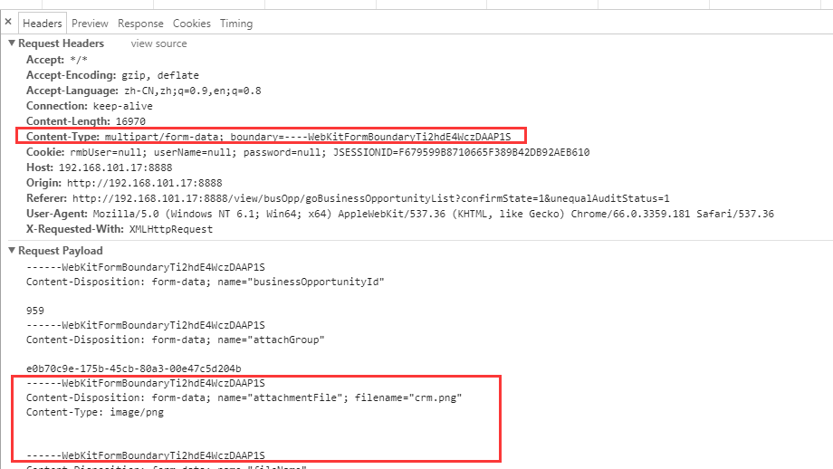
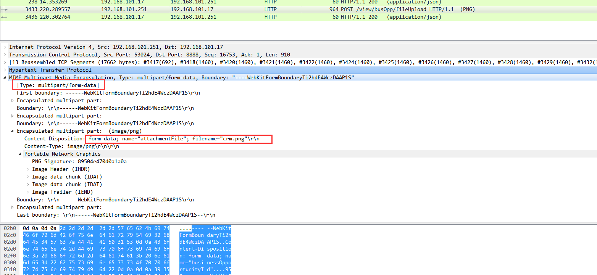

# 习题解答

## 1 学习HTTP POST附件的协议以及参考实现代码，了解HTTP文件上传的原理（客户端与服务器端）
答：文件上传 http的Content-Type必须设置为multipart/form-data
The media-type multipart/form-data follows the rules of all multipart
   MIME data streams as outlined in [RFC 2046].  In forms, there are a
   series of fields to be supplied by the user who fills out the form.
   Each field has a name. Within a given form, the names are unique.

   "multipart/form-data" contains a series of parts. Each part is
   expected to contain a content-disposition header [RFC 2183] where the
   disposition type is "form-data", and where the disposition contains
   an (additional) parameter of "name", where the value of that
   parameter is the original field name in the form. For example, a part
   might contain a header:

        Content-Disposition: form-data; name="user"

   with the value corresponding to the entry of the "user" field.

   Field names originally in non-ASCII character sets may be encoded
   within the value of the "name" parameter using the standard method
   described in RFC 2047.

chrome抓包如下



Wireshark抓包如下



## 2 用JDK线程池框架实现PPT中的HTTP Server的代码，每个TCP客户端连接一个线程来处理。

### (1)Thread多线程
```
package zhan.foundation.lesson08;

import java.io.*;
import java.net.ServerSocket;
import java.net.Socket;
import java.util.List;
import java.util.stream.Collectors;
import java.util.stream.IntStream;

/**
 * Created by Administrator on 2018/5/19 0019.
 */
public class ThreadServiceHttp {
    public static void main(String[] args) throws Exception{

        ServerSocket serverSocket = new ServerSocket(8080);
        List<Thread> threadList = IntStream.range(0,5)
                .mapToObj(m->new Thread(()->{
                    try{
                        while(true){

                            System.out.println(Thread.currentThread().getName() + " before serverSocket.accept()");
                            Socket socket = serverSocket.accept();
                            System.out.println(Thread.currentThread().getName() + " Request: " + socket.toString() + " cooonected");
                            LineNumberReader in = new LineNumberReader(new InputStreamReader(socket.getInputStream()));
                            String lineInput;
                            String requestPage = null;
                            while((lineInput = in.readLine()) != null){
                                System.out.println(lineInput);
                                if(in.getLineNumber() == 1){
                                    requestPage = lineInput.substring(lineInput.indexOf("/") + 1,lineInput.lastIndexOf(" "));
                                    System.out.println("request page :" + requestPage);
                                }else{
                                    if(lineInput.isEmpty()){
                                        System.out.println(Thread.currentThread().getName() + " header finished");
                                        doResponseGet(requestPage,socket);
                                    }
                                }
                            }
                        }

                    }catch (Exception e){
                        e.printStackTrace();
                    }
                        })

                )
                .collect(Collectors.toList());

        threadList.forEach(t->t.start());

    }


    private static void doResponseGet(String requestPage, Socket socket) throws IOException {
        final String WEB_ROOT = "f:";
        File theFile = new File(WEB_ROOT,requestPage);
        OutputStream out = socket.getOutputStream();
        if(theFile.exists()){
            //从服务器根目录下找到用户请求的文件并发送回浏览器
            InputStream fileIn = new FileInputStream(theFile);
            byte[] buf = new byte[fileIn.available()];
            fileIn.read(buf);
            fileIn.close();

            String msg = new String(buf,"gb2312");
            String response = "HTTP/1.1 200 ok\r\n";
            response += "Server: zhanyd Server/0.1 \r\n";
            response += "Content-Length: " + (msg.length()) + "\r\n";
            response += "\r\n";
            response += msg;
            out.write(response.getBytes());
            out.flush();
            //socket.close();
            System.out.println(Thread.currentThread().getName() + " return file " + requestPage);
        }else{
            String msg = "Hello you connected me...";
            String response = "HTTP/1.1 200 ok\r\n";
            response += "Server: zhanyd Server/0.1 \r\n";
            response += "Content-Length: " + (msg.length()) + "\r\n";
            response += "\r\n";
            response += msg;
            out.write(response.getBytes());
            out.flush();
            System.out.println(Thread.currentThread().getName() + " Hello you connected me...");
        }

        //out.close();
    }


}

```

### (2)ExecutorService多线程
```
package zhan.foundation.lesson08;

import java.io.*;
import java.net.ServerSocket;
import java.net.Socket;
import java.util.concurrent.ExecutorService;
import java.util.concurrent.Executors;

/**
 * Created by Administrator on 2018/5/19 0019.
 */
public class ExecutorServiceHttp {

    public static void main(String[] args) throws Exception{
        ExecutorService executorService = Executors.newFixedThreadPool(5);
        ServerSocket serverSocket = new ServerSocket(8080);
        executorService.execute(new ServiceHttp(serverSocket));

    }


    public static class ServiceHttp implements Runnable {
        ServerSocket serverSocket;

        public ServiceHttp(ServerSocket serverSocket){
            this.serverSocket = serverSocket;
        }

        @Override
        public void run(){
            try{
                while (true) {
                    System.out.println(Thread.currentThread().getName() + " before serverSocket.accept()");
                    Socket socket = serverSocket.accept();
                    System.out.println(Thread.currentThread().getName() + " Request: " + socket.toString() + " cooonected");
                    LineNumberReader in = new LineNumberReader(new InputStreamReader(socket.getInputStream()));
                    String lineInput;
                    String requestPage = null;
                    while ((lineInput = in.readLine()) != null) {
                        System.out.println(lineInput);
                        if (in.getLineNumber() == 1) {
                            requestPage = lineInput.substring(lineInput.indexOf("/") + 1, lineInput.lastIndexOf(" "));
                            System.out.println("request page :" + requestPage);
                        } else {
                            if (lineInput.isEmpty()) {
                                System.out.println(Thread.currentThread().getName() + " header finished");
                                doResponseGet(requestPage, socket);
                            }
                        }
                    }
                }
            }catch (Exception e){
                e.printStackTrace();
            }
        }
    }


    private static void doResponseGet(String requestPage, Socket socket) throws IOException {
        final String WEB_ROOT = "f:";
        File theFile = new File(WEB_ROOT,requestPage);
        OutputStream out = socket.getOutputStream();
        if(theFile.exists()){
            //从服务器根目录下找到用户请求的文件并发送回浏览器
            InputStream fileIn = new FileInputStream(theFile);
            byte[] buf = new byte[fileIn.available()];
            fileIn.read(buf);
            fileIn.close();

            String msg = new String(buf,"gb2312");
            String response = "HTTP/1.1 200 ok\r\n";
            response += "Server: zhanyd Server/0.1 \r\n";
            response += "Content-Length: " + (msg.length()) + "\r\n";
            response += "\r\n";
            response += msg;
            out.write(response.getBytes());
            out.flush();
            //socket.close();
            System.out.println(Thread.currentThread().getName() + " return file " + requestPage);
        }else{
            String msg = "Hello you connected me...";
            String response = "HTTP/1.1 200 ok\r\n";
            response += "Server: zhanyd Server/0.1 \r\n";
            response += "Content-Length: " + (msg.length()) + "\r\n";
            response += "\r\n";
            response += msg;
            out.write(response.getBytes());
            out.flush();
            System.out.println(Thread.currentThread().getName() + " Hello you connected me...");
        }

        //out.close();
    }

}

```


## 3 加分选项：
模拟JSP效果，比如命名为 xxx.msp文件，里面有动态执行的脚本，当HTTP Server收到请求xxx.msp请求时，
  去加载此文件执行，传递request params给脚本，脚本中完成变量的替换，输出为静态的txt或者json等格式输出给客户端，
   如用户请求 http://localhost/hellow.msp?user=aaaa&password=123456
    程序判断此用户是否合法，然后输出 Welcome my big hero aaaa 或者,Sorry ，不认识你。。。

  具体做法可以参考如下：
   第一，采用某种动态脚步技术，如JSR223支持的脚本语言，包括JDK8的Javascript Nashorn，Groovy等来实现xxx.msp
         Beanshell是轻量级的java 脚本语言，也可以使用，http://www.beanshell.org，
   第二，定义一个 pervlet接口（模拟servlet）
               public interface pervlet
                   public PvReponse handlerRequest(PvRequest req)
           采用JDK Compile API来动态编译xxx.msp到class，并且加载执行。

