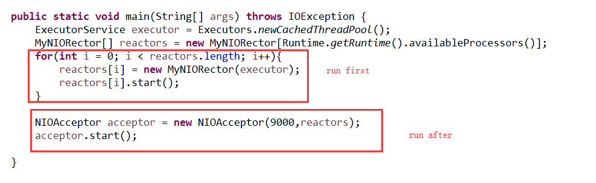

# 习题解答

## 1 MyNIORector 这里的selector.select(500); 如果改为selector.select()，会是什么结果，结合socketChannel.register(selector, SelectionKey.OP_READ)这里的JavaDoc，研究说明问题所在

答：先运行语句selector.select(500);
	后运行注册感兴趣事件语句selectionKey = socketChannel.register(selector, SelectionKey.OP_READ);
	

	如果改为selector.select()，程序在select()处阻塞，注册感兴趣事件无法刷新到selector中，程序会一直阻塞；如果是selector.select(500)，每过500毫秒会刷新感兴趣事件，读事件能被selector感知。

